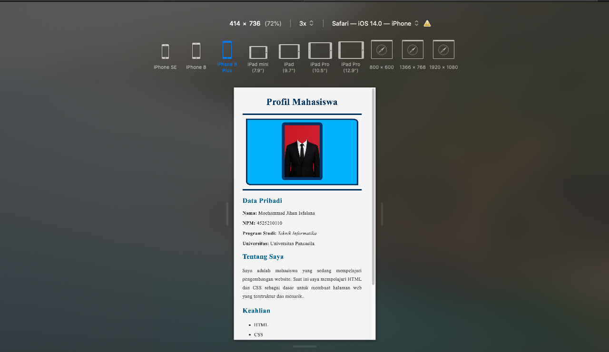
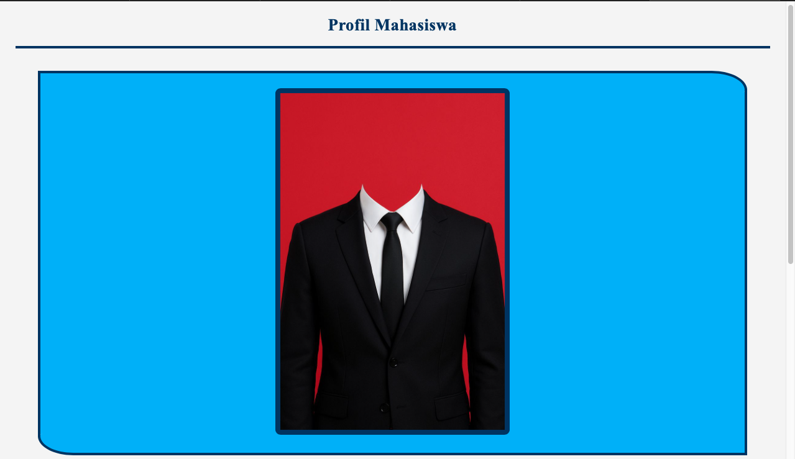
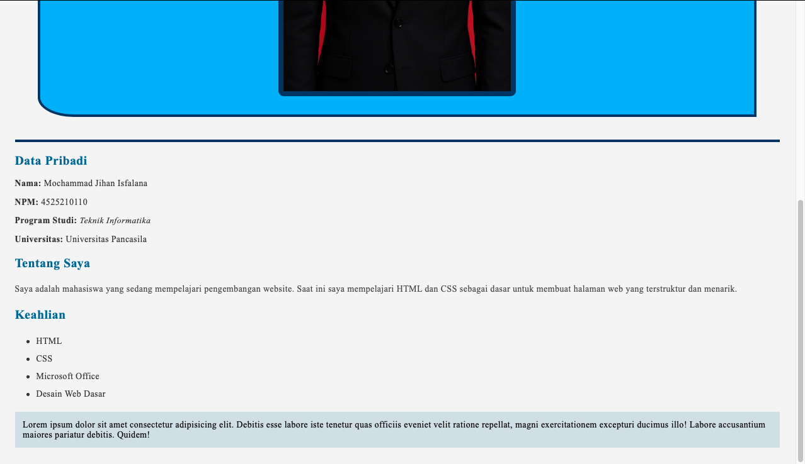
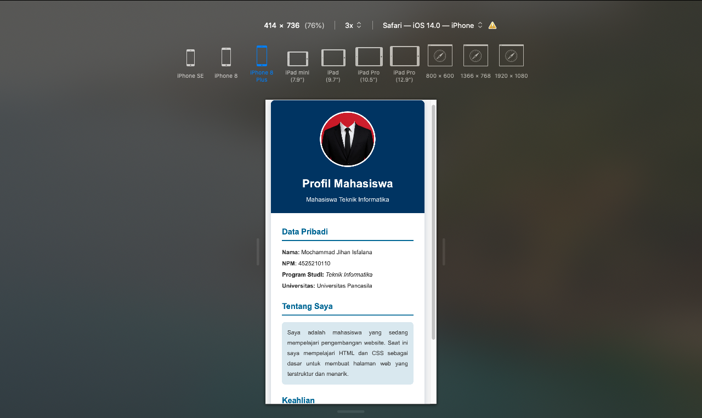
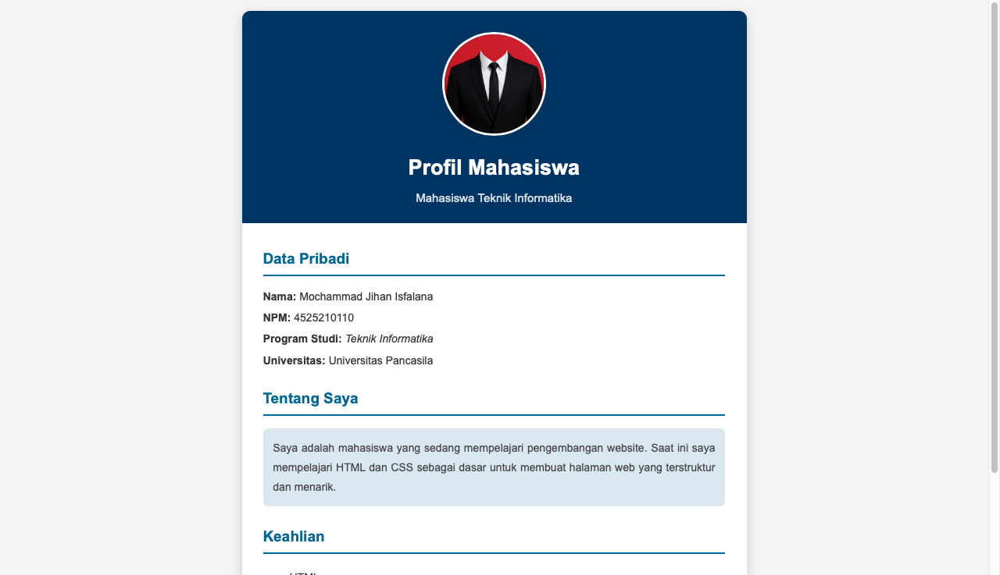

# Dokumentasi Tugas Individu — Pertemuan 3 (CSS Inline)

## Identitas Mahasiswa
```Mahasiswa
Nama: Mochammad Jihan Isfalana
NPM: 4525210110
Mata Kuliah: Prak. Desain Web
```

## 1. Sebelum vs Sesudah

| Aspek | Sebelum | Sesudah |
|---|---|---|
| Font | Times New Roman (serif) | Segoe UI, Arial, sans-serif |
| Layout | Selebar layar, teks mepet tepi | Kartu `max-width: 760px`, di tengah (`margin: 0 auto`) |
| Foto | Kotak biru cerah, border 5px + 10px, `width="33.33%"` | Bulat 150×150px, `object-fit: cover`, border putih 4px, di header navy |
| Judul | Navy di atas latar abu-abu | Putih di atas header navy, `margin-bottom: 5px` |
| Subjudul | Underline 5px | Border-bottom 3px (lebih rapi) |
| Blok "Lorem ipsum" | Ada (hanya demo RGBA) | Dihapus; RGBA dipakai pada kotak "Tentang Saya" |
| Bayangan | `box-shadow: rgba(...)` (tidak valid) | `box-shadow: 0 4px 16px rgba(0,51,102,.2)` |

## 2. Property CSS inline yang digunakan (>10)
`font-family`, `background-color`, `margin`, `padding`, `line-height`, `max-width`, `border-radius`, `overflow`, `box-shadow`, `text-align`, `color`, `font-size`, `font-weight`, `border`, `border-bottom`, `width`, `height`, `object-fit`, `text-align: justify`. (**19 property**, syarat minimal 10.)

## 3. Format warna (>4 macam)
| Format | Contoh di kode |
|---|---|
| Name | `white` (judul, border foto) |
| HEX | `#003366`, `#f4f4f4`, `#333333`, `#444444` |
| RGB | `rgb(0, 102, 153)` (subjudul) |
| RGBA | `rgba(0, 102, 153, 0.15)`, `rgba(255, 255, 255, 0.85)`, `rgba(0, 51, 102, 0.2)` |
| HSL | `hsl(200, 100%, 30%)` (garis bawah subjudul) |

## 4. Masalah dan solusi
1. **`box-shadow: rgba(0,102,153,0.15)` tidak berpengaruh.** Nilai shadow butuh offset (x, y) minimal; warna saja tidak cukup. Solusi: `0 4px 16px rgba(...)`.
2. **Foto tidak proporsional.** `width="33.33%"` membuat ukuran berubah mengikuti lebar layar. Solusi: ukuran tetap 150×150px + `object-fit: cover` agar tidak gepeng.
3. **Underline 5px terlalu tebal** dan sulit dikontrol. Solusi: `border-bottom: 3px solid`.
4. **Warna nyaris tidak kontras** (biru terang `rgb(0,174,255)` di belakang foto ber-border navy). Solusi: latar navy `#003366` dengan foto dan teks putih.
5. **Pengulangan gaya.** Gaya subjudul dan paragraf disalin di banyak tag. Ini bukan bisa dihilangkan di CSS inline, hanya bisa diterima (lihat studi kasus).

## 5. Studi kasus: kemampuan & keterbatasan CSS inline
**Kemampuan:** cepat, tidak butuh file tambahan, prioritas tinggi (mengalahkan aturan lain), cocok untuk perubahan tipografi, warna, jarak, dan penekanan visual secara langsung pada satu elemen.

**Keterbatasan (yang ditemui di tugas ini):**
- Kode berulang: 3 subjudul memakai gaya yang sama, ditulis 3 kali. Ubah satu warna = ubah di banyak tempat.
- Tidak bisa `:hover`, `:focus`, atau pseudo-element.
- Tidak bisa `@media` sehingga tidak ada layout berbeda untuk desktop vs mobile. Kompromi yang dipakai: `max-width` + lebar fleksibel.
- HTML jadi panjang dan sulit dibaca; struktur dan tampilan bercampur (melanggar *separation of concerns*).
- Sulit dirawat di proyek nyata → solusinya CSS eksternal (`style.css` + `<link>`).

## 6. Screenshot (bukti sebelum/sesudah)
Hasil Tugas Praktikum Desain Web Pertemuan 03:
---
**Sebelum:** 
(**Mobile**)

(**Desktop**)


---
**Sesudah:**
(**Mobile**)

(**Desktop**)
